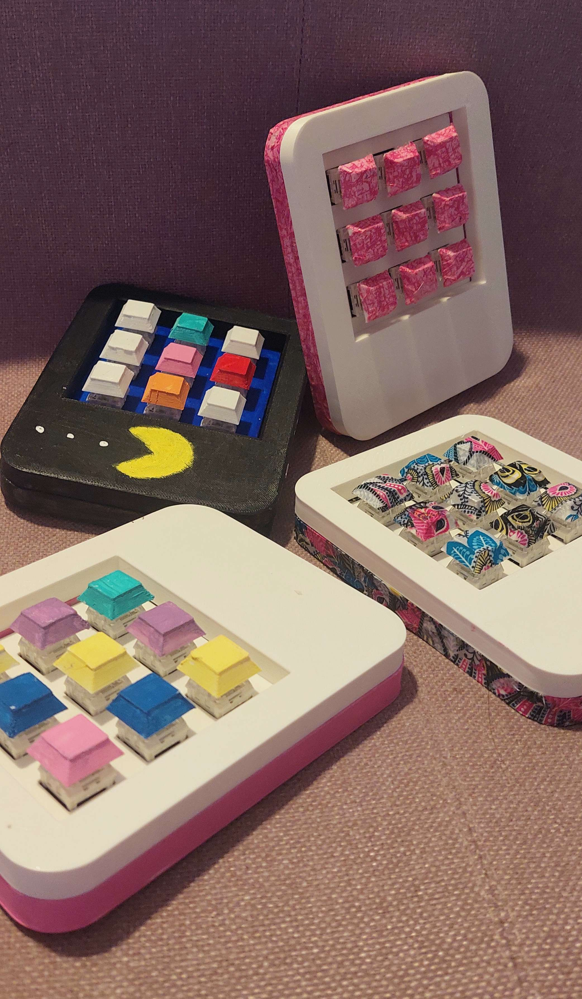

# Macropad
Documents to build a macropad with case and keycaps printed in 3d.

# Necessary material:
* Switches x9   [link](https://fr.aliexpress.com/item/1005003913593085.html?spm=a2g0o.order_list.0.0.1a0e5e5bt12LGT&gatewayAdapt=glo2fra)
* Raspberry Pi Pico board [link](https://fr.aliexpress.com/item/1005003796653297.html?spm=a2g0o.order_list.0.0.1a0e5e5bt12LGT&gatewayAdapt=glo2fra)
* wires         [link](https://fr.aliexpress.com/item/32958017642.html?spm=a2g0o.order_list.0.0.1a0e5e5bt12LGT&gatewayAdapt=glo2fra)
* Hot-swaps x9  [link](https://fr.aliexpress.com/item/4001051840976.html?spm=a2g0o.order_list.0.0.1a0e5e5bt12LGT&gatewayAdapt=glo2fra)
* USB-c female  [link](https://fr.aliexpress.com/item/1005002795893679.html?spm=a2g0o.order_list.0.0.1a0e5e5bt12LGT&gatewayAdapt=glo2fra)
* Magnets 8x5[mm] x3 [link](https://fr.aliexpress.com/item/1005001832581513.html?spm=a2g0o.order_list.0.0.1a0e5e5bt12LGT&gatewayAdapt=glo2fra)

 

